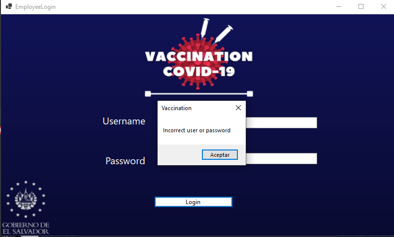

# Documentación oficial

ASPECTOS TÉCNICOS:

A continuacion se detallan los aspectos técnicos del presente proyectos, abarcando las extensiones que fueron instaladas en  el desarrollo del mismo y también los programas utilizados

-Windows 10 

-Visual Studio 2019

-Paquetes NuGet

	*Microsoft.EntityFramewokCore
	*Microsoft.EntityFramewokCore.Design
	*Microsoft.EntityFramewokCore.SqlServer
	*ITextSharp

-Microsoft SQL Server Management Studio 18
-.Net 5.0

# Instalación

-Para la correcta instalación del programa se deben cambiar las cadenas de conexión del código, tener el Sql server abierto con la base PROYECTOPOO abierta y
luego entrar en la carpeta del ejecutable

# Manual de usuario

Descripción del proyecto:

Vaccination Covid-19: Es una aplicación que facilita a la gran cantidad de nuestra población a potenciar la eficiencia del proceso de vacunación, de forma que alrededor de todo el territorio nacional se instalen una serie de cabinas que faciliten a los ciudadanos vulnerables que no disponen de los recursos tecnológicos necesarios, el poder gestionar su proceso de vacunación mediante la eficiencia brindada de las cabinas de atención.

La aplicación cuanta, con un sistema básico con todas sus funciones a la mano, que facilita la comprensión y la eficiencia a las personas que interactúen con él, sobre todo está bajo el control de una serie de empleados que manejan la serie de datos almacenados de cada individuo de la población.

Toda información que se inserte en la siguiente aplicación es redireccionada a una base de datos que se encarga de previsualizar a cada individuo dentro de ella, así almacenando sus datos como los nombres completos, edad, las fechas de aplicación de las diferentes dosis, la vacuna aplicada entre otros datos.

Funcionamiento de la Aplicación

	1.    A la hora de ingresar a la aplicación mediante el ejecutable .exe, se abrirá una ventana que permite iniciar sesión mediante los usuarios registrados en la base de datos que poseen el puesto de gestores, los cuales tiene un acceso completo en la interacción con la aplicación.

	2.    Ya en el main menu, podemos encontrarnos cinco botones diferentes los cuales cumplen las funciones de: Registrar una cita del ciudadano, cola de espera, proceso de vacunación, historial de vacunación e historial de inicios de sesión.

	2.1    Al ingresar al botón “Appointment Registration”, podemos apreciar diferentes apartados que deben ser completados con los datos de la persona como: su DUI, nombre, dirección, correo electrónico, número de teléfono, institución a la que pertenece, edad y como ultimo parámetro es si la persona sufre algún tipo de enfermedad.

	2.2    Al seleccionar el botón “Wait Line”, podemos apreciar una pestaña en la que encontramos un dataGridView, que contiene una lista con la cita de cada uno de los pacientes activos, cada uno enumerado en orden de vacunación.

	2.3    Al ingresar a la pestaña al botón “Vaccination Process” podemos ver un DataGridView donde se encuentran un listado con los nombres de cada uno de los pacientes inscritos en la base de datos, los cuales recibirán la vacuna contra el COVID. Para continuar se debe seleccionar el paciente con quien se proseguirá el proceso de vacunación.

	2.3.1    Ya seleccionado el nombre del paciente continuará con el proceso de vacunación, a este se le mostrar una ventado que contendrá los consentimientos acerca de la vacuna contra el COVID. El paciente deberá leer el consentimiento y aceptarlos para vacunarse donde aparecerá una ventana de carga que representa el paciente siendo vacunado.

	2.3.2 Al completarse la barra de carga, el paciente observara una ventana emergente que le preguntara al paciente si presento algún tipo de efecto secundario. En caso de seleccionar si, mediante un comboBox el paciente deberá seleccionar los síntomas presentados.

	2.4    Al presionar “Vaccination History”, se aprecian un listado de los pacientes que ya han recibido su primera dosis con ella automáticamente se genera la segunda cita de vacunación con su fecha y hora.

	2.4.1    Como puede apreciarse, bajo la tabla donde está enlistada la información de los pacientes con sus respectivas citas de vacunación, se encuentra un botón nombrado “Create PDF” al presionarlo se abrirá el explorador de Windows el cual te pedirá una dirección donde generará un archivo pdf con todas las citas del sistema.

	2.5    El ultimo botón “Employee History”, cumple la función de historial. Al acceder en él lo que se puede ver una ventana con un listado que muestra los logins con su fecha y hora de los gestores que acceden a la aplicación.

# Tabla de errores

| Lugar|Error|Solucion |Imagen|
| -- | -- | -- | -- |
| Login | Usuario o contraseña no encontrados | Verirficar si el usuario o contraseña corresponden a los guardados en la base de datos | 

